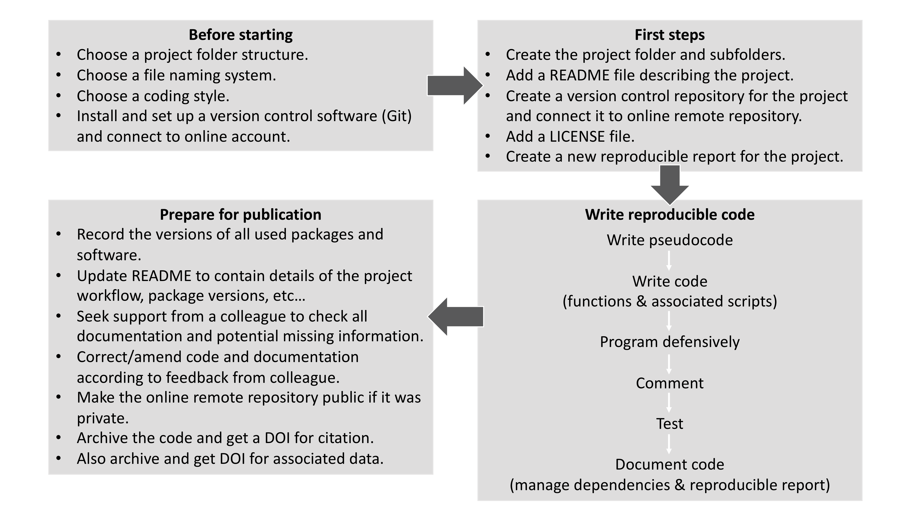
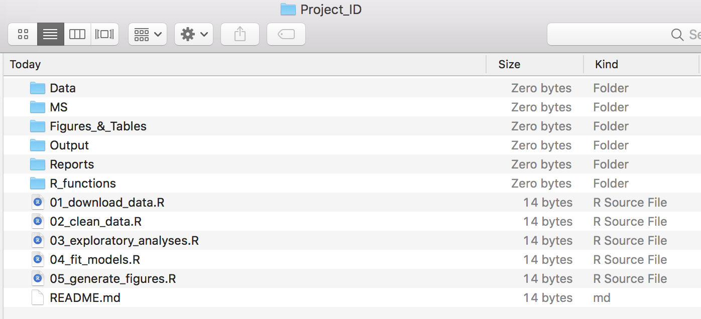

```{r packages, echo=FALSE, warning=FALSE, include=FALSE}
library(knitr)
library(rmarkdown)
library(bookdown)
library(formattable)
library(kableExtra)
library(dplyr)
library(magrittr)
library(prettydoc)
library(htmltools)
library(knitcitations)
library(devtools)

#Generate BibTex citation file for all R packages used to produce report
knitr::write_bib(.packages(), file = 'packages.bib')
```

```{r setup, include=FALSE, cache=FALSE, message = FALSE}
# Chunk options: see http://yihui.name/knitr/options/ ###

## Text results
#opts_chunk$set(echo = TRUE, warning = TRUE, message = TRUE, include = TRUE)

## Code decoration
opts_chunk$set(tidy = TRUE, tidy.opts = list(blank = FALSE, width.cutoff = 60), highlight = TRUE)

## Caching code
opts_chunk$set(cache = 2, cache.path = "cache/")

## Plots
#opts_chunk$set(fig.path = "Figures_MS/", dev=c('pdf', 'png'), dpi = 300)

## Locate figures as close as possible to requested position (=code)
knitr::opts_chunk$set(fig.pos = 'H')
```

# Introduction

The following steps have to be fully integrated in order to produce a reproducible code:

- **Step 1:** Establish a reproducible project workflow.
- **Step 2:** Organize project for reproducibility.
- **Step 3:** Ensure basic programming standards.
- **Step 4:** Document and manage dependencies.
- **Step 5:** Produce a reproducible report (with R Markdown).
- **Step 6:** Implement a version control protocol (with Git).
- **Step 7:** Ensure archiving and citation of code.

In this chapter, we will cover steps 1 to 4. Steps 5 and 7 have been respectively studied in chapters 1 and 4 (Data management), whereas step 6 will be covered in the bioinformatic tutorial associated to chapter 11.

# Literature and web resources used for this chapter

This chapter is based on:

- @RepCode -- *A Guide to Reproducible Code in Ecology and Evolution* published by the [British Ecological Society](https://www.britishecologicalsociety.org).
- @wickham2014advanced -- *Advanced R* by Hadley Wickham (https://adv-r.hadley.nz)
- Hadley Wickham’s R Style Guides: http://adv-r.had.co.nz/Style.html
- Absolute vs relative paths: https://en.wikipedia.org/wiki/Path_(computing)#Absolute_and_relative_paths

# "Draw" a reproducible project workflow

```{r ReproWorkflow, echo=FALSE, fig.align="center", fig.cap="A simple reproducible project workflow.", out.width = '100%'}

```

An example of a reproducible project workflow is displayed in Figure \@ref(fig:ReproWorkflow). This workflow serves as a basis for the discussion presented in this chapter.

# Organize project for reproducibility

## The repeatable, reproducible analysis workflow

The fundamental idea behind a robust, reproducible analysis is **a clean, repeatable script-based workflow (i.e. the sequence of tasks from the start to the end of a project) linking raw data through to clean data and to final analysis outputs**.

## Principles of a good analysis workflow

Please find below some key concepts associated with this task:

- Start your analysis from copies of your raw data.
- Any cleaning, merging, transforming, etc. of data should be done in scripts, not manually.
- Split your workflow (scripts) into logical thematic units. For example, you might separate your code into scripts that 
  (i) load, merge and clean data, 
  (ii) analyse data, 
  (iii) produce outputs like figures and tables.
- Eliminate code duplication by packaging up useful code into custom functions (see Step3 : Ensure basic programming standards). Make sure to **comment your functions thoroughly, explaining their expected inputs and outputs (as well as the associated arguments and their options), and what they are doing and why**.
- Document your code and data as comments in your scripts and by producing separate documentation (using the R Markdown format).
- Any intermediary outputs generated by your workflow should be kept separate from raw data.
- Keep your raw data raw.

## Organizing and documenting workflows

The simplest and most effective way of documenting your workflow – its inputs and outputs – is through good file system organization, and informative, consistent naming of materials associated with your analysis. The name and location of files should be as informative as possible on what a file contains, why it exists, and how it relates to other files in the project. These principles extend to all files in your project (not just scripts) and are also intimately linked to good research data management (see Chapter 4: Data management).

## File system structure

It is best to keep all files associated with a particular project in a single root directory. RStudio projects offer a great way to keep everything together in a self-contained and portable (i.e. so they can be moved from computer to computer) manner, allowing internal pathways to data and other scripts to remain valid even when shared or moved.

```{r ProjStuct, echo=FALSE, fig.align="center", fig.cap="Example file structure of a simple analysis project. Make sure you left-pad single digit numbers with a zero for the R scripts to avoid having those misordered.", out.width = '100%'}

```

There is no single best way to organize a file system. The key is to make sure that the structure of directories and location of files are consistent, informative and works for you. Please find below an example of basic project directory structure (Figure \@ref(fig:ProjStuct)):

- The `data` folder contains all input data (and metadata) used in the analysis.
- The `MS` folder contains the manuscript.
- The `Figures_&_Tables` folder contains figures and tables generated by the analyses.
- The `Output` folder contains any type of intermediate or output files (e.g. simulation outputs, models, processed datasets, etc.). You might separate this and also have a `cleaned-data` folder.
- The `R_functions` folder contains R scripts with function definitions.
- The `Reports` folder contains RMarkdown files that document the analysis or report on results.
- The scripts (`*.R`) that actually do things are stored in the root directory together with the `README.md` file. If your project has too many scripts, you might consider organizing them in a separate folder.

### Use R to infer data structure and organization of files in project

Inferring the directory tree structure of your project provides a simple and efficient way to summarize the data structure and organization of files related to your project as well as track versioning. The R base functions *list.files()* and *file.info()* can be combined to obtain information on files stored in your project. Please see code below for an example associated to Figure \@ref(fig:ProjStuct).  

```{r TreeDir, echo=TRUE, tidy=TRUE, warning=FALSE}
#Set working directory to your project directory
setwd("Project_ID/")

#Produce a list of all files in working directory together with info related to those files
file.info(list.files(recursive = TRUE, full.name = TRUE))
```

The code presented here could be at the core of a user-defined function that would aim at managing files and ensuring data reliability for your project.

## Informative, consistent naming

Good naming extends to all files, folders and even objects in your analysis and serves to make the contents and relationships among elements of your analysis understandable, searchable and organised in a logical fashion (see Figure \@ref(fig:ProjStuct) for examples and Chapter 4: Data management for more details).

# Ensure basic programming standards

## Writing pseudocode

Pseudocode is an informal high-level description of the operating principle of a computer program or other algorithm. It uses the structural conventions of a normal programming language (here R), but is intended for human reading rather than machine reading. Here, you will establish the big steps (and their associated tasks) and tie R functions (existing or that have to be made) to those steps. This provides the backbone of your code and will support writing it.  

## Writing code

Writing clear, reproducible code has (at least) three main benefits:
1. It makes returning to the code much easier a few months down the line; whether revisiting an old project, or making revisions following peer review. 
2. The results of your analysis are more easily scrutinized by the readers of your paper, meaning it is easier to show their validity. 
3. Having clean and reproducible code available can encourage greater uptake of new methods that you have developed.

To write clear and reproducible code, it is recommended to follow the workflow depicted in Figure \@ref(fig:ReproWorkflow). The following section explains each part of the workflow along with some tips for writing code. Although this workflow would be the ‘gold standard’, just picking up some of the elements can help to make your code more effective and readable. 

### Style guides

The foundation of writing readable code is to choose a logical and readable coding style, and to stick to it. Some key elements to consider when developing a coding style are:

- Using meaningful file names, and numbering these if they are in a sequence (see Figure \@ref(fig:ProjStuct) for examples and Chapter 4: Data management for more details).

```{r tidy=F, eval=FALSE}
### Naming files
# Good
fit-models.R
utility-functions.R

# Bad
foo.r
stuff.r
```

- Concise and descriptive object names. Variable names should usually be nouns and function names verbs. Using names of existing variables or functions should be avoided.

```{r tidy=F, eval=FALSE}
### Naming objects
# Good
day_one
day_1

# Bad
first_day_of_the_month
DayOne
dayone
djm1
```

- Spacing should be used to improve visual effect: use spaces around operators (`=`, `+`, `-`, `<-`, etc.), and after commas (much like in a sentence).

```{r tidy=F, eval=FALSE}
### Spacing
# Good
average <- mean(feet / 12 + inches, na.rm = TRUE)

# Bad
average<-mean(feet/12+inches,na.rm=TRUE)
```

- Indentation should be with two spaces, not tabs, and definitely not a mixture of tabs and spaces.
```{r tidy=F, eval=FALSE}
### Indentation
long_function_name <- function(a = "a long argument", 
                               b = "another argument",
                               c = "another long argument") {
  # As usual code is indented by two spaces.
}
```

- Assignment. Use `<-`, not `=`, for assignment.

```{r tidy=F, eval=FALSE}
### Assignment
# Good
x <- 5

# Bad
x = 5
```

The most important role of a style guide, however, is to introduce consistency to scripts.

### Portable code: Absolute vs. Relative paths

When working collaboratively, portability between machines is very important, i.e. will your code work on someone else’s computer? Portability is also important if code is being run on another server, for example a High Performance Cluster. One way to improve portability of code is to avoid using absolute paths and use only relative paths (see https://en.wikipedia.org/wiki/Path_(computing)#Absolute_and_relative_paths). 

**An absolute path is one that gives the full address to a folder or file. A relative path gives the location of the file from the current working directory.** 

For example based on `species_data.csv` stored in the `Data` folder shown in Figure \@ref(fig:ProjStuct):

```{r eval=FALSE}
# Absolute path -----------------------------
C:/Project_ID/Data/species_data.csv

Project_ID = Project root folder = working directory

# Relative path ------
Data/species_data.csv
```

Relative paths are particularly useful when transferring between computers because while I may have stored my project folder in ‘C:/Project_ID/’, you may have yours stored in ‘C:/Users/My Documents’. Using relative paths and running from the project folder will ensure that *file-not-found errors* are avoided. 

RStudio is especially designed to help portability of code. For instance, you can easily set the working directory in RStudio by clicking:

```{r eval=FALSE}
Session > Set Working Directory > To Source File Location
```

or using the *setwd()* function. Please see chapter 1 for more details.

## Commenting code

How often have you revisited an old script six months down the line and not been able to figure out what you had been doing? Or have taken on a script from a collaborator and not been able to understand what their code is doing and why? An easy win for making code more readable and reproducible is the liberal, and effective, use of comments. A comment is a line of code that is visible, but does not get run with the rest of the script. In R and Python this is signified by beginning the line with a #.

**One good principle to adhere to is to comment the ‘why’ rather than the ‘what’**. The code itself tells the reader what is being done, it is far more important to document the reasoning behind a particular section of code or, if it is doing something nonstandard or complicated, to take some time to describe that section of code.

It is also good practice to use comments to add an overview at the beginning of a script, and commented lines of `---` to break up the script: e.g. in R

```{r eval=FALSE}
# Load data -------
```

## Writing functions

Often when you are analyzing data, you need to repeat the same task many times. For example, you might have several files that all need loading and cleaning in the same way, or you might need to perform the same analysis for multiple species or parameters. The best way (by far) to handle those tasks is to write functions and store those in a specific folder (e.g. `R_functions` in \@ref(fig:ProjStuct)). Those functions will be loaded into the R environment (and therefore made available to users) by using the `source()` function, which will be placed at the top of your R script. Please see chapter 1 part D for more details.

**A function is a self-contained block of code that performs a single action. A function takes in a set of arguments, applies the action, and returns an object of any data type. A function should not rely on data from outside of the function, and should not manipulate data outside of the function.**

### Your first (or actually second) function

Below is a user-defined function inferring the square of a number. Please see comment in code for more details.

```{r echo=T, eval=T}
# Create a user-defined function in R to calculate square number:
# - argument: base (= one number)
# - output: square of base (=one number)
square_number <- function(base){
         square <- base*base
         return(square)
}

# Calling a user-defined function in R
square_number(5)
```

Note that you are asking R to return the result using `return(square)`. This is not strictly needed in this example, but using `return()` saves problems when writing more complicated functions.

### Exercise: Apply function across a vector

Amend the code shown above to calculate square numbers of multiple numbers stored in a vector (e.g. from 1 to 10).

## Defensive programming: Supporting debugging!

Defensive programming is a technique to ensure that code fails with well-defined errors, i.e. where you know it should not work. The key here is to ‘fail fast’ and ensure that the code throws an error as soon as something unexpected happens. This creates a little more work for the programmer, but makes debugging code a lot easier at a later date.

In order to demonstrate how to apply defensive programming to your code a new function will be defined:

```{r eval=T, echo=T}
# Define a power function (exp_number): y = x^n
# - Arguments: base (= x) and power (= n)
# - Output: a number (y)
exp_number <- function(base, power) {
        exp <- base^power
        return(exp)
}

# Call function
exp_number(2,5)
```

You can employ defensive programming on the `exp_number| function defined above. The function requires that both arguments are numeric, if you were to provide a string (e.g. a word) as input, you would get an error:

```{r echo=T, eval=T, error=TRUE}
#Example where we don't respect the class associated with the argument base
exp_number("hello",5)
```

If you add in a line of code to test the data type of the inputs, you get a more meaningful error.

```{r echo=T, eval=T, error=TRUE}
# Define a power function (exp_number): y = x ^n
# - Arguments: base (= x) and power (= n)
# - Output: a number (y)
exp_number <- function(base, power) {
    if(class(base) != "numeric" | class(power) != "numeric"){
          stop("Both base and power inputs must be numeric")
    }
    exp <- base^power
    return(exp)
}

# Call function
exp_number("hello",5)
```

Although in this case debugging the error would not have taken long, in more complicated functions you are likely to either have less meaningful error messages, or code that runs for some time before it fails. By applying defensive programming and adding in these checks to the code, you can find unexpected behavior sooner and with more meaningful error messages.

## Testing scientific code

In the experimental sciences, rigorous testing is applied to ensure that results are accurate, reproducible and reliable. Testing will show that the experimental setup is doing what it is meant to do and will quantify any systematic biases. Results of experiments will not be trusted without such tests; why should your code be any different? Testing scientific code allows you to be sure that it is working as intended and to understand and quantify any limitations of the code. Using tests can also help to speed up the code development process by finding errors early on.

Although the instructor recognizes the importance of establishing protocols, those tests will be especially relevant if you were to design R packages. However, the instructor would recommend informal testing by loading functions that have been written by the students and running *ad hoc* tests in the command line to make sure that they perform as expected.

# Document & manage dependencies

Reproducibility is also about making sure someone else can re-use your code to obtain the same results as you (see [Appendix 1] for more details).

For someone else to be able to reproduce the results included in your report, you need to provide more than the code and the data. You also need to document the exact versions of all the packages, libraries, and software you used, and potentially your operating system as well as your hardware.

R itself is very stable, and the core team of developers takes backward compatibility (old code works with recent versions of R) very seriously. However, default values in some functions change, and new functions get introduced regularly. If you wrote your code on a recent version of R and give it to someone who has not upgraded recently, they may not be able to run your code. Code written for one version of a package may produce very different results with a more recent version.

## Reporting R packages & versions

With R, the simplest (but a useful and important) approach to document your dependencies is to report the output of `sessionInfo()` (or `devtools::session_info()`). Among other information, this will show all the packages and their versions that are loaded in the session you used to run your analysis. If someone wants to recreate your analysis, they will know which packages they will need to install. Please see [Appendix 2] for more details.

For instance, here is the output of `sessionInfo()` showing the R version and packages that I used to create this document:

```{r echo=T, eval=T}
sessionInfo()
```

## Using R packages to help managing dependencies and recreate setup

This will not be covered in this class, but it is worth noting that there are at least two R packages allowing to better manage dependencies and recreate your setup. Those packages are:

- *checkpoint*: https://cran.r-project.org/web/packages/checkpoint/vignettes/checkpoint.html
- *packrat*: https://rstudio.github.io/packrat/ 

The instructor expects students to discuss with their supervisors to identify if those packages are potentially useful for their projects. 

# References

<div id="refs"></div>

# (APPENDIX) Appendix {-}

# Appendix 1

Citations of all R packages used to generate this report. 

```{r generateBibliography, results="asis", echo=TRUE, warning = FALSE, message=FALSE}
library("knitcitations")
cleanbib()
options("citation_format" = "pandoc")
read.bibtex(file = "packages.bib")
``` 

# Appendix 2

Version information about R, the operating system (OS) and attached or R loaded packages. This appendix was generated using `sessionInfo()`.

```{r eval=T, echo=F, warning = FALSE, message=FALSE}
sessionInfo()
```

